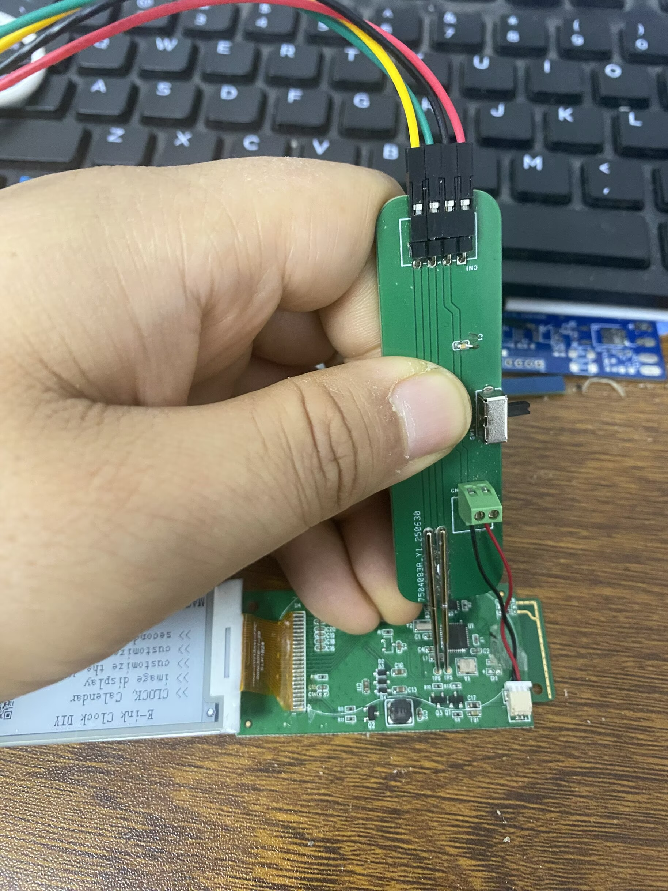
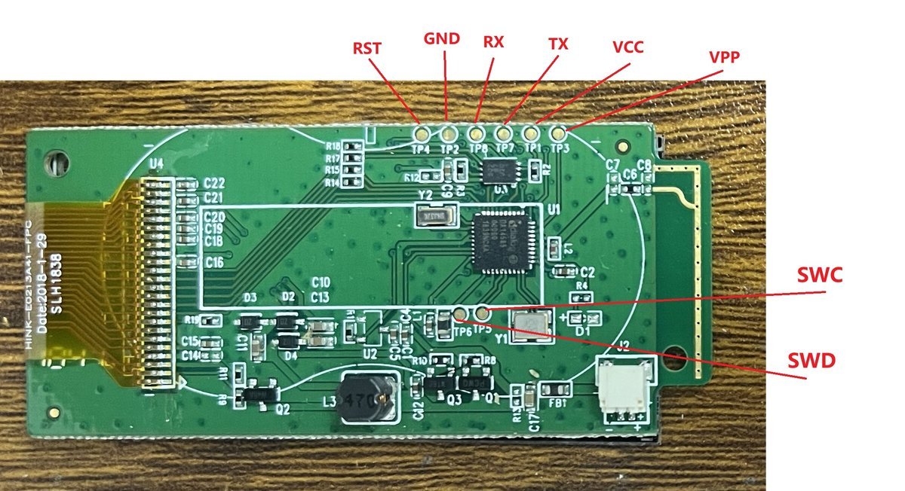

# Programming the HMCLOCK firmware permanently

How to get firmware onto the Hema ESL clock (DA14585 + external SPI flash) so it
**survives power cycles**, and how the persistence mechanism actually works.

---

## Background: how this device boots

The DA14585 has **no internal flash**. Firmware always executes from RAM at
`0x07FC0000`, and on every power-on the boot chain copies an image from
external SPI flash into RAM and jumps to it:

```
Power-on
  └─> ROM / OTP boot loader (marker 0x1234A5A5 at OTP 0x07F8FE00)
        └─> reads the product header at flash 0x38000
              ├─ image slot 0 (this unit: 0x2000)
              └─ image slot 1 (this unit: 0x4000)
                    └─ picks a slot, copies the image body to 0x07FC0000, runs it
```

Each slot image starts with a 64-byte Dialog SUOTA header:

| Offset | Size | Field |
|-------:|-----:|-------|
| 0      | 4    | magic `70 51 AA` + generation id (byte 3) |
| 4      | 4    | code size (bytes, body only) |
| 8      | 4    | CRC32 of the body |
| 28     | 4    | firmware version (`EPD_VERSION`) |
| 32     | 1    | encryption flag = 0 |

> **Note:** slot addresses are *not* fixed. They are read from the product
> header at `0x38000`. On most units they are `0x4000` / `0x1F000`; on some
> units (as observed here) they are `0x2000` / `0x4000` and the two slots
> overlap. Never assume fixed addresses, and never erase a region you have not
> derived from the product header.

### Flash layout (typical unit)

| Address   | Content                                        |
|-----------|------------------------------------------------|
| `0x00000` | legacy boot header (`70 50 ...`) — ignored by the boot chain on these units |
| `0x20000`/slot0, `0x40000`/slot1 *(from product header)* | firmware images (header + body) |
| `0x38000` | product header (`70 52`, slot addresses)        |
| `0x39000` | e-paper pinout (`09 01 ...`)                    |
| `0x3A000` | e-paper resolution/mode info                    |
| `0x3B000` | uploaded-image header (magic `IMG1`, size, CRC; written last) |
| `0x3C000` | persisted display mode + panel size override `{0xA5, mode, reserved, size}` (own sector; size `0xFF` = unset) |
| `0x3D000` | uploaded-image pixels (logical 1bpp, ≤ 8 KB)    |

---

## Building the firmware (command line)

A full rebuild from a terminal, no IDE needed. This is the method that produced
the working `.bin` files (Keil MDK 5, Arm Compiler 6.24, target `DA14585`).

```
cd Keil_5
"%LOCALAPPDATA%/Keil_v5/UV4/UV4.exe" -r ble_app_peripheral.uvprojx -j0 -t DA14585 -o build.log
```

(From Git Bash use `"/c/Users/<you>/AppData/Local/Keil_v5/UV4/UV4.exe"`; adjust
the path if Keil is installed elsewhere, for example `C:/Keil_v5/UV4/UV4.exe`.)

* `-r` is a **full rebuild**. Use it every time, to be safe: `EPD_VERSION` lives
  in a header (`src/config/user_config.h`), and an incremental build (`-b`)
  might not recompile every file that uses it.
* `-j0` hides the GUI and `-o` writes the compiler output to a log file. A run
  takes about 15 seconds.
* The build is good when the log ends with `0 Error(s), 0 Warning(s)`.
* An after-build step runs `fromelf --bincombined`, which produces the file to
  flash. The output is in `Keil_5/out_DA14585/Objects/` (git-ignored):

  | File | Use |
  |------|-----|
  | `ble_app_peripheral_585.bin` | flash with the web app (Method 2) |
  | `ble_app_peripheral_585.axf` | debugger / OpenOCD RAM load (Method 1) |
  | `ble_app_peripheral_585.hex` | hex image |

**Check the version before flashing.** The web app reads it from the `.bin`
and shows it in the flash confirmation (`v<n>`), which is the low 16 bits of
`EPD_VERSION`. To check it from a script, search the file for the 8-byte marker
`79 13 A5 F9 86 EC 5A 06`; the little-endian 16-bit version is at marker
offset +8:

```python
b = open("ble_app_peripheral_585.bin", "rb").read()
i = b.find(bytes([0x79, 0x13, 0xA5, 0xF9, 0x86, 0xEC, 0x5A, 0x06]))
print(b[i + 9] * 256 + b[i + 8])
```

> **Always bump `EPD_VERSION` for any firmware change** and rebuild fully. A
> stale `.bin` that reports an old version is the usual reason a flashed change
> "does nothing": `selflash()` identifies a build by size + version only, and the
> web app will happily flash the same version again.

---

## Method 1 — Debugger RAM load (development)

The firmware self-installs. No flash programming step is needed:

1. Build in Keil (or load the `.axf` with OpenOCD, see *Readme.MD*).
2. **Run the image once from the debugger** (RAM load at `0x07FC0000`).
3. On boot, `selflash()` compares the running build against what is in flash:
   * different → it erases and rewrites the **primary image slot** (slot 0 from
     the product header) with the running image, stamped with a generation id
     one above any existing slot, so the boot chain boots the new build on
     every booter policy;
   * identical (size + CRC + version all match slot 0) → it skips in
     milliseconds.
4. **Power-cycle.** The new firmware boots from flash and persists.

Timing: the install pass erases and rewrites ~38 KB over a bit-banged SPI
bus — expect the first boot after a new build to take a few seconds.
Every subsequent boot checks slot 0 and skips; those boots are fast.

> **Do not remove power during the first boot after a new install** — that is
> when flash is being rewritten. If you do, the device may not boot; just
> repeat step 2 (RAM load) and let it re-install. This always recovers the
> device, since the RAM load does not depend on flash contents.

### Verification without a UART

Connect with any BLE scanner (nRF Connect, LightBlue, ...) and read the
**FF04** characteristic (32 bytes, little-endian):

| Bytes    | Meaning                                              |
|----------|------------------------------------------------------|
| `0..3`   | OTP boot marker (`A5 A5 34 12` = present)             |
| `4..19`  | boot header at flash `0x00000` (raw)                  |
| `20..22` | running version, low 3 bytes (`0E 0F A5` for 0xA50F000E) |
| `23`     | this boot's flash action + status bits: `01` = slots re-installed, `02` = up-to-date skip; when re-installed, bits `04`/`08`/`10`/`20` flag *why*: header magic / size / CRC / version mismatched |
| `24..27` | CRC32 of the running image                            |
| `28..31` | running image size in bytes                           |

If byte 23 is `01` on *every* boot, the up-to-date check is failing — file an
issue / see `src/epd/spi_flash.c` (`selflash_slots`).

For full logs, enable `CFG_PRINTF` in
`src/config/da14585_config_basic.h` and tap **UART2 TX = P0.4, 115200 8N1**.

---

## Method 2 — Bluetooth OTA (end users)

1. Open the Web Bluetooth control page (`WebApp/WebApp_EN/index.html`).
2. Connect, choose a firmware `.bin`, click *Firmware Update*.
3. The device writes the image into the inactive slot with a bumped generation
   id, verifies a CRC32 of the received payload, then resets into the new
   image.

> **Known limitation on slot-0-booting units:** OTA writes the *inactive*
> slot, but the boot chain on these units boots slot 0 unconditionally — so an
> OTA'd image may not take effect on the next reset. If testing shows the
> update doesn't stick, the OTA completion path needs to install into the
> primary slot the same way `selflash_install()` does. SWD-installed builds
> are unaffected.

---

## Why firmware used to "revert"

Older versions of the self-flash logic assumed fixed slot addresses
(`0x4000`/`0x1F000`) and wrote each update only into the *inactive* slot. On
units whose stock product header points the slots elsewhere (`0x2000`/`0x4000`,
overlapping), updates landed in a region the boot chain treated differently,
and the old image kept winning the boot selection after reset. Additionally,
the 1-byte generation id was incremented without a wrap check — once it passed
`0x7F` it became negative (`0x80` = `-128` as a signed char) and ranked *below*
every other image.

The current scheme avoids both problems: slots are always taken from the
product header, the running build is installed into the primary slot (slot 0)
with a wrap-safe generation id that outranks any existing slot
(`selflash_install()` / `bump_image_flag` in `src/epd/spi_flash.c`), so it
boots under every booter selection policy observed on these devices.

---

## Hardware access: SWD jig and test points



Method 1 needs a J-Link on the SWD test points; a pogo-pin jig avoids soldering.



| TP | Signal | Chip pin | Use |
|---|---|---|---|
| TP1 | VCC | | supply |
| TP2 | GND | | ground |
| TP3 | VPP | | OTP programming voltage |
| TP4 | RST | RST | reset (J-Link) |
| TP5 | SWC | SWCLK | J-Link SWD clock |
| TP6 | SWD | SWDIO | J-Link SWD data |
| TP7 | TX | P0_4 | UART2 TX (debug log, 115200 8N1) |
| TP8 | RX | P0_5 | UART2 RX (shared with SPI flash DI) |

Full module pinout: `docs/pinout_0.md`.
