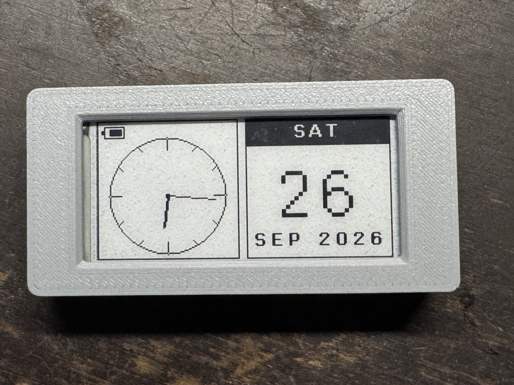
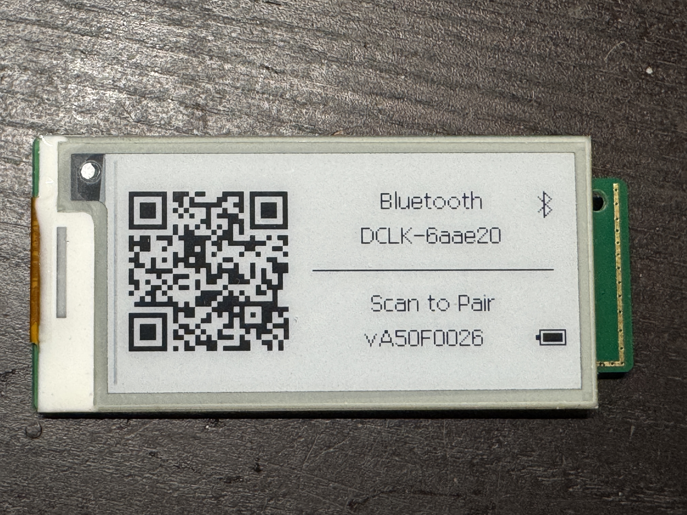

# Hema ESL Clock

This is a fork of the original [HMCLOCK](https://github.com/tpunix/HMCLOCK) project by [tpunix](https://github.com/tpunix).

Fork maintained by Terence Ang - motionfxdesign.

---



## Project Introduction

This project utilizes discarded **Hema Electronic Shelf Label (ESL)** hardware from supermarkets to implement a simple yet practical electronic clock with the following features:

* ✅ Analog clock + calendar card display (weekday, day, month, year)
* ✅ Display battery level
* ✅ Bluetooth time synchronization
* ✅ Time calibration
* ✅ Bluetooth OTA firmware update
* ✅ Image mode: upload any picture from the web app (converted to 1-bit black and white); it is kept across power loss
* ✅ Low-battery screen and a nightly full refresh to clear e-paper ghosting

---

**Contents:** [Supported screens](#supported-screens) · [What you need](#what-you-need) · [Compilation and Flashing](#compilation-and-flashing) · [Updating the firmware](#updating-the-firmware) · [Time sync](#bluetooth-time-synchronization) · [Troubleshooting](#troubleshooting) · [Case](#case-assembly) · [Flash layout](#flash-storage-layout) · [License](#license) · [Changelog](CHANGELOG.md)

---

## Supported screens

The clock drives every panel in **black and white** only (the red plane of tri-colour panels is not driven); the table lists what has been tested. The panel size normally comes from the configuration record in flash (`0x3A000`). If the record is missing or wrong (for example after swapping the panel), pick the size in the web app's Display card (**Panel** dropdown, firmware 0xA50f0026 or later); the clock restarts to apply it. The **Test pattern** button next to it draws a border, corner blocks, size, grey/black swatches and line patterns to check the result.

| Model | Size | Colors | Resolution | Interface | Status |
|-------|------|--------|------------|-----------|--------|
| HINK-E0213A41/A55 | 2.13" | B/W | 212×104 | Soldered | Tested working (A41-FPC). Reference panel on the HMCLOCK board |
| HINK-E0213A53-FPC-A0 | 2.13" | B/W | 212×104 | Soldered | Tested working |
| HINK-E0213A07-A1 | 2.13" | B/W | 212×104 | Socket | Tested working |
| OPM021B1 | 2.13" | B/W | 250×122 | Socket | Not tested |
| HINK-E0213A22-A0 | 2.13" | B/W/Red | 250×122 | Soldered | Works in B/W only; select `250 x 122`. Contrast was weak, probably because the board's boost circuit is sized for the A41 |
| HINK-E0213A67 | 2.13" | B/W/Red | 250×122 | Soldered | Not tested |
| HINK-E029A10 | 2.9" | B/W/Red | 296×128 | Socket | Not tested (layout only) |

Controllers: A41/A55 IL3897 / SSD1675B, OPM021B1 IL3895 / SSD1673A, A67 and E029A10 IL3897. Pinouts: `pinout_1/0.xlsx`, `pinout_0.xlsx`, `Hardware/HINK-E0213A41-FPC.md`. The E029A10 is the easiest to disassemble; the 2.13" panels are hard.

Notes:

* Tri-colour (black/white/red) panels show black and white only; the red plane is not driven.
* The size cannot be read from the panel itself, so it must match the attached panel.
* Only these three sizes have a screen layout. Any other size falls back to the 212 x 104 layout.

---

## Changelog

See [CHANGELOG.md](CHANGELOG.md).

---

## What you need

* A supported Hema ESL (see the table above); the 2.13" A41 is the reference.
* A programmer for the first flash: a J-Link, or a CMSIS-DAP/ST-Link probe with OpenOCD. A pogo-pin jig on the board's SWD test points makes this easy (see [`Programming.md`](Programming.md)).
* A battery or bench supply; most salvaged ESL batteries are nearly flat.
* Optional: a printed case (`3D/EPD case.step`).
* A Chrome or Edge browser with Web Bluetooth to use the [control panel](https://terenceang.github.io/HMCLOCK-EN/).
* Pinouts and panel wiring: `Hardware/` and `docs/pinout_*`.

---

## Compilation and Flashing

Please download the DA14585 [SDK](https://www.renesas.com/en/document/swo/sdk60221401-da1453x-da145856 "SDK"), currently using version **6.0.22.1401**.

1. Place this project inside:

   ```
   SDK_PATH/projects/target_apps/ble_examples
   ```

2. Open the project with Keil MDK to compile.

3. Once compiled:

   * **Run in debug mode once**, and the firmware will be automatically written to Flash (see [`Programming.md`](Programming.md) for how persistence works and what to expect on the first boot);
   * Or use the **SmartSnippets Toolbox** to download the firmware to RAM and run it once;
   * Or flash it with **OpenOCD** (see below) if you're using a CMSIS-DAP/ST-Link probe instead of a J-Link.

### Flashing with OpenOCD

The DA14585/586 has no internal flash — firmware normally runs from RAM, either loaded by a debugger or copied there by the ROM bootloader from external SPI flash/OTP. `Keil_5\openocd_da14585.cfg` drives this RAM-load-and-run path over SWD using a CMSIS-DAP-compatible probe (tested with the same probe configured under Keil's `CMSIS_AGDI` debug driver in this project).

Install OpenOCD (e.g. `winget install xpack-dev-tools.openocd-xpack`), then from the `Keil_5` directory:

```
openocd -f openocd_da14585.cfg -c "ram_load_run out_DA14585/Objects/ble_app_peripheral_585.axf" -c shutdown
```

This halts the core, writes the `.axf` into RAM at `0x07fc0000`, sets `SP`/`PC` from the vector table, and resumes — equivalent to Keil's RAM-debug flow. As with that flow, the app's own first-boot logic writes itself to external SPI flash, so it persists across power cycles without any explicit flash step.

Notes:
* OpenOCD has no flash driver for this chip's external SPI flash/OTP, so `program`/`flash write_image` won't work here — only the RAM-load path does.
* Use a plain `reset halt`, not a hardware reset + delay: a core-only reset (`SYSRESETREQ`) does **not** re-trigger the ROM's flash-to-RAM boot copy on this chip (that only happens on power-on-reset), so there's no race to wait out. Adding a delay before halting risks catching the core mid-execution and triggering a HardFault.

---

## Updating the firmware

After the first flash, update over Bluetooth: open the [control panel](https://terenceang.github.io/HMCLOCK-EN/), connect, choose a firmware `.bin` and click **Firmware Update**. The clock checks the image, reboots into it and the page reconnects. Details, and a known limitation on some units, are in [`Programming.md`](Programming.md#method-2--bluetooth-ota-end-users).

---

## Bluetooth Time Synchronization

The project's built-in web page provides **Web Bluetooth** functionality for manual time synchronization:

* The clock **always advertises**, so it can be connected at any time: every 0.69 s until the first sync (the pairing screen), then every 5.12 s. A BLE stack with nothing scheduled idles at about 18 µA instead of 3 µA, so keeping a slow advertisement running also saves battery. After the first sync the clock can take up to about 10 seconds to appear in the browser's device chooser;
* The pairing screen shows a **Bluetooth icon** beside "Bluetooth" while the clock is advertising or connected. The synced clock face shows no Bluetooth icon, because the clock is always contactable;
* Open the web page, click "Connect", select your device, and click "Sync Time" to complete the synchronization. The page reads the clock back after the write and reports an error if the clock rejected the time. If the link drops, the page tells you and stops the live clock readout;
* Advertising pauses while a phone is connected and resumes as soon as it disconnects, however the link ended.

## Time Calibration

According to observations, by default, the clock runs about two seconds fast per day. The accuracy can be improved by fine-tuning the timer interval.
After syncing the time, performing two calibrations 2 to 3 weeks apart will keep the clock running very accurately.

* Once the device is connected, click the "Time Calibration" button and wait about one minute.
* Perform a time synchronization immediately after calibration.

[](https://terenceang.github.io/HMCLOCK-EN/)

Open the [web control panel](https://terenceang.github.io/HMCLOCK-EN/) in Chrome or Edge (Web Bluetooth) to connect to the clock.

When powered on for the first time, it will show a pairing page. Scan the QR code to open the web page and pair.




---

## Power Profile

Measured with a Nordic Power Profiler Kit II in source-meter mode (100 kHz sampling), on the panel-and-board combination used for development. The advertising figures are from test builds using the same advertising settings as the current firmware (0xA50f0035); treat everything here as approximate.

| State | Current / charge | Notes |
|---|---|---|
| Sleep, between radio events | **2.8 – 3.4 µA** | needs a scheduled BLE event, see below |
| Sleep with **no** BLE activity scheduled | **18.3 µA** | why the firmware never stops advertising |
| Advertising event | about 11 µC, 5 mA peak | one event per interval, on three channels |
| Advertising every 5.12 s (synced) | **about 5.3 µA** average | 3.2 µA sleep + about 2.1 µA of events |
| Advertising every 0.69 s (pairing screen) | about 19 µA average | used only until the first sync |
| Connected, idle | about 95 µA average | before the slower connection parameters apply |
| Panel fast refresh (every minute) | about 2.0 mC, up to about 40 mA, about 2.5 s | followed by about 47 µA for about 2.5 s (about 0.12 mC) |
| Power-on, boot and pairing-screen draw | about 11.9 mC over about 5 s | full refresh; brief inrush of over 100 mA |

The BLE stack idles at about 18 µA when nothing is scheduled but only about 3 µA when it has a periodic event to wake for, so the clock advertises for good (0.69 s before the first sync, 5.12 s after) instead of stopping. A 10.24 s interval was too slow for a browser or phone to find the clock, and 2.56 s works but costs more.

**Estimated average, synced and advertising:** 60 refreshes an hour at about 2 mC is about 123 mC, and advertising plus sleep is about 19 mC, so roughly **142 mC/h, or about 40 µA**. The panel refresh is about 85% of that, so refreshing less often saves far more than any radio change.

| Battery (parallel cells) | Usable capacity (assumed) | Estimated life |
|---|---|---|
| 1 × CR2032 | about 200 mAh | about 210 days |
| 2 × CR2032 | about 400 mAh | about 420 days |
| 2 × CR2450 | about 1000 mAh | about 1050 days |

These are estimates: the refresh charge varied between captures (2.0 to 4.4 mC, depending on the waveform and probably the supply voltage), and coin cells deliver less than their rating at the 2.6 V cut-off and under the panel's current pulses. Compare charges within one capture, and set the PPK supply to the voltage the clock will really see.

---

## Troubleshooting

* **Wrong or garbled picture, or the panel stays blank:** the panel size can't be read from the panel. Pick the right size in the control panel's **Panel** dropdown and use **Test pattern** to check.
* **Weak contrast:** seen on the 250 x 122 HINK-E0213A22-A0, probably because the board's boost circuit is sized for the A41.
* **Slow to appear after syncing:** once synced the clock advertises every 5.12 s, so give the device chooser up to about 10 seconds. A power-cycle brings back the pairing screen and fast advertising (you then need to sync the time again).
* **Can't pair:** scan the QR code shown on the panel; Web Bluetooth needs Chrome or Edge on a device with a Bluetooth adapter.
* **Firmware didn't change after an update:** see the OTA limitation in [`Programming.md`](Programming.md#method-2--bluetooth-ota-end-users).
* **Clock drifts:** run **Time Calibration** twice, 2 to 3 weeks apart.

---

## Case Assembly

Case design files are stored in the `3D/` directory. It features a sliding lid design, and 3D printing with resin is recommended.

---

## Flash Storage Layout

### Firmware slots and boot headers

The boot chain (ROM or the ESL's OTP boot loader) reads the **product header at
`0x38000`** (`70 52 ...`), which contains the start addresses of two firmware
image slots. Each slot begins with a 64-byte Dialog SUOTA image header
(`70 51 AA` + generation id, code size, CRC32, version at offset 28).

* The slot addresses are **not fixed** — read them from the product header.
  Most units use `0x4000`/`0x1F000`; some units use `0x2000`/`0x4000` with
  overlapping slots, and their boot chain boots slot 0 unconditionally.
* Self-flash (`selflash()` in `src/epd/spi_flash.c`) installs new builds into
  the primary slot with a wrap-safe generation id; see [`Programming.md`](Programming.md).
* A legacy single-image boot header (`70 50 ...`) may also exist at `0x00000`;
  on the units tested it is not used by the boot chain.

### Screen Pin Configuration (Address `0x39000`)

Example:

```
09 01 FF FF FF FF FF FF 21 22 10  01  20  07  11  23
                        CS ?? RST CLK SDI DC BUSY PWR
```

* First byte `09`: Screen Type
* Second byte `01`: Pin configuration enable flag (any value other than `01` is invalid)

### Screen Resolution and Info (Address `0x3a000`)

Example:

```
00 25 00 00 92 fa a8 fe 00 01 80 00 28 01 04 00
                          0080  0128          128x296  BWR
```

---

## Additional Notes

* The original ESL firmware is stored in the SUOTA section of Flash;
* Most ESLs use an OTP bootloader but will continue to load firmware from Flash;
* Flash contains the screen and pin configuration, so the new firmware does not need to hardcode this information;
* The stock firmware cannot be scanned via Bluetooth, making it difficult to update via OTA directly without initially flashing;
* Most ESL batteries are nearly depleted, so it is recommended to disassemble and replace the power supply.

---

## License

This fork's changes are released under the [MIT License](LICENSE), copyright Terence Ang. It is based on the original [HMCLOCK](https://github.com/tpunix/HMCLOCK) project by tpunix, which does not state a license; credit for the original work goes to tpunix. The DA14585 SDK, SmartSnippets and other vendor files in `docs/` are Renesas software under Renesas's own terms.
