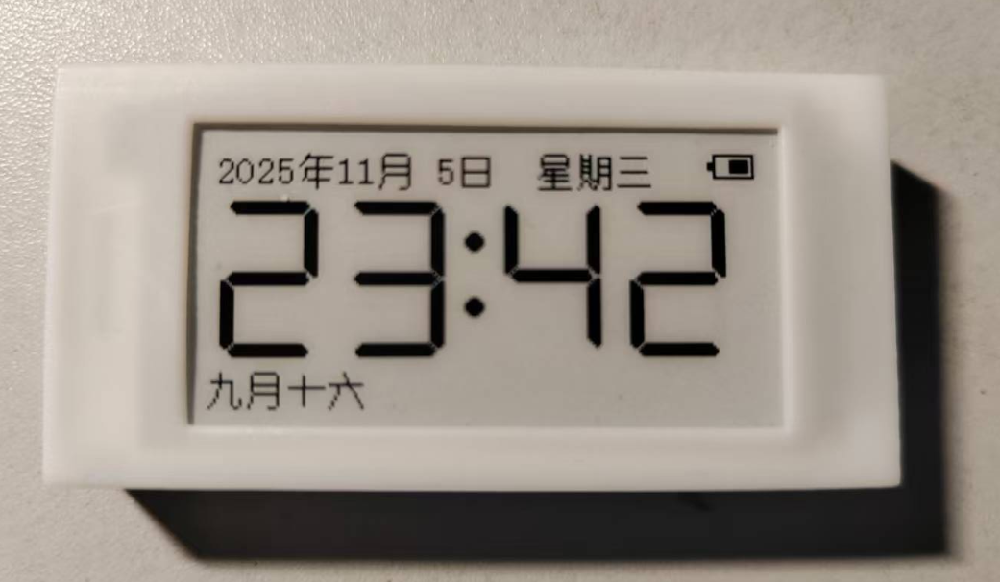
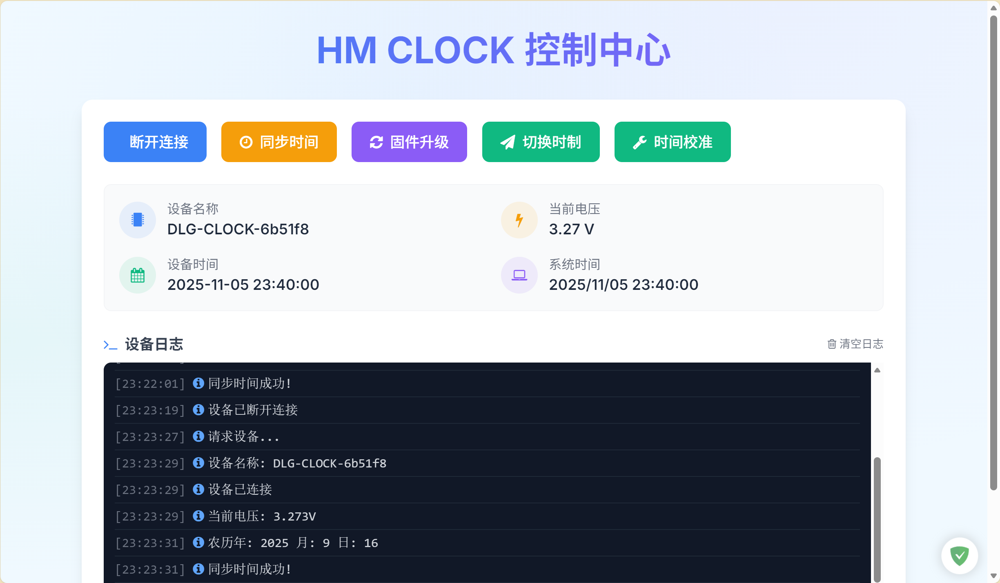
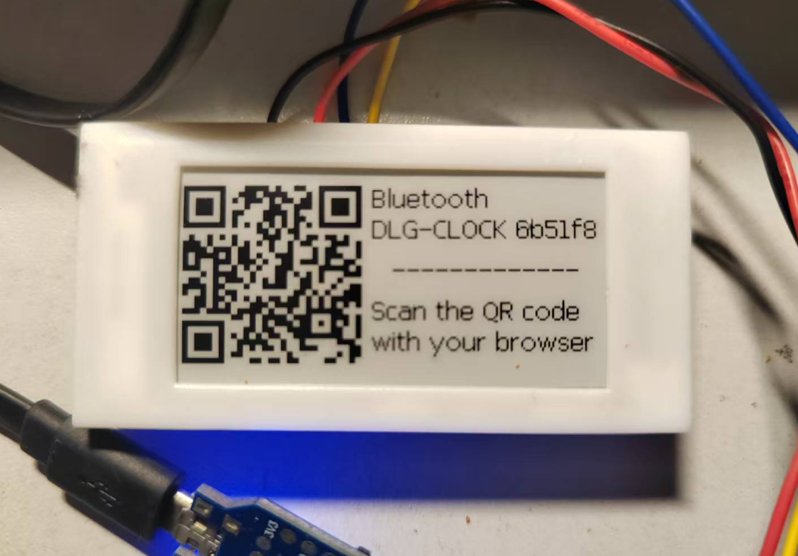

# Hema ESL Clock

This is a fork of the original [HMCLOCK](https://github.com/tpunix/HMCLOCK) project by [tpunix](https://github.com/tpunix).

---



## Project Introduction

This project utilizes discarded **Hema Electronic Shelf Label (ESL)** hardware from supermarkets to implement a simple yet practical electronic clock with the following features:

* ✅ Analog clock + calendar card display (weekday, day, month, year)
* ✅ Display battery level
* ✅ Bluetooth time synchronization
* ✅ Time calibration
* ✅ Bluetooth OTA firmware update

---

## Changelog

### 0xA50f000c

* Redesigned the clock screen: an analog clock face card on the left, an iOS-style calendar icon card on the right (weekday header, big day-of-month, month + year), both sized to fill nearly the whole screen.
* Moved the battery and Bluetooth status icons into the clock card's top-left corner.
* Fixed a `draw_pixel()` bug where `WHITE` was a no-op (it only ever cleared pixels, never set them), which silently broke drawing white text over a black-filled background — needed for the calendar card's inverted weekday header.
* Added bold and letter-spaced ("kerned") text-drawing primitives to `epd_gui.c`, used to keep the calendar card's small text legible at this size.
* Added an English translation of the Web Bluetooth control page (`WebApp/WebApp_EN/webApp.html`), alongside the existing Chinese one.
* Added a Light/Dark/System theme toggle to both web app versions.
* Added a matching analog-clock + calendar-card preview to both web app versions, shown by default — driven by the connected device's time, or system time when not connected.

### 0xA50f000b

* Translated the remaining Chinese code comments to English across `epd.c`, `epd_gui.c`, `spi_flash.c`, `user_custs1_impl.c`, `user_peripheral.c`.
* Added hardware pinout documentation (`Hardware/HINK-E0213A41-FPC.md`) and pinout reference PDFs.
* Added the initial Web Bluetooth control-center web app (`WebApp/WebApp_CN/webApp.html`) for connecting, time sync, firmware update, and calibration.

### 0xA50f000a

* Bolded the 7-segment clock digits (`font50.h`/`font66.h`) by dilating each glyph 1px inward on every stroke; glyph dimensions/advance widths unchanged.

### 0xA50f0009

* Removed the lunar calendar / solar-term / traditional-holiday feature entirely (lunar date tables, solar-term calculation, holiday table, and their on-screen display).
* Converted the on-screen date to English (ISO `YYYY-MM-DD` plus a 3-letter weekday, e.g. `2026-07-18  Sat`) and AM/PM to `AM`/`PM`.
* Renamed the BLE device from `DLG-CLOCK-XXYYZZ` to `DCLK-XXYYZZ`.
* Regenerated the pairing-screen QR code to point at a temporary LAN address.
* `clock_set` (BLE `0x91`) no longer reads/validates the lunar-date bytes; the minimum accepted write length dropped from 12 to 9 bytes. The web app no longer computes or sends them.

### 0xA50f0008

* Removed a dead/unreachable duplicate branch in the BLE long-value write dispatcher.
* Added range validation on BLE-set clock/lunar-date fields (`0x91`), preventing out-of-bounds array reads from a malformed write before they could reach the lunar calendar lookup tables.
* Added minimum-length checks on incoming BLE writes before trusting fixed-offset fields, for the clock-set, calibration, and OTA commands.
* Removed the unused, already-diverged `spi_flash_hwctl.c` duplicate flash/OTA driver (it wasn't part of any build target and was missing a reset call its live counterpart had).
* OTA updates now verify a CRC32 of the received firmware image before resetting into it. A failed check aborts the update and invalidates the new image's header so a stray reset (watchdog, power blip) can't boot into a partially-written image.

---

## Compilation and Flashing

Please download the DA14585 [SDK](https://www.renesas.com/en/document/swo/sdk60221401-da1453x-da145856 "SDK"), currently using version **6.0.22.1401**.

1. Place this project inside:

   ```
   SDK_PATH/projects/target_apps/ble_examples
   ```

2. Open the project with Keil MDK to compile.

3. Once compiled:

   * **Run in debug mode once**, and the firmware will be automatically written to Flash;
   * Or use the **SmartSnippets Toolbox** to download the firmware to RAM and run it once;
   * Or flash it with **OpenOCD** (see below) if you're using a CMSIS-DAP/ST-Link probe instead of a J-Link.

### Flashing with OpenOCD

The DA14585/586 has no internal flash — firmware normally runs from RAM, either loaded by a debugger or copied there by the ROM bootloader from external SPI flash/OTP. `Keil_5\openocd_da14585.cfg` drives this RAM-load-and-run path over SWD using a CMSIS-DAP-compatible probe (tested with the same probe configured under Keil's `CMSIS_AGDI` debug driver in this project).

Install OpenOCD (e.g. `winget install xpack-dev-tools.openocd-xpack`), then from the `Keil_5` directory:

```
openocd -f openocd_da14585.cfg -c "ram_load_run out_DA14585/Objects/ble_app_peripheral_585.axf" -c shutdown
```

This halts the core, writes the `.axf` into RAM at `0x07fc0000`, sets `SP`/`PC` from the vector table, and resumes — equivalent to Keil's RAM-debug flow. As with that flow, the app's own first-boot logic writes itself to external SPI flash, so it persists across power cycles without any explicit flash step.

Notes:
* OpenOCD has no flash driver for this chip's external SPI flash/OTP, so `program`/`flash write_image` won't work here — only the RAM-load path does.
* Use a plain `reset halt`, not a hardware reset + delay: a core-only reset (`SYSRESETREQ`) does **not** re-trigger the ROM's flash-to-RAM boot copy on this chip (that only happens on power-on-reset), so there's no race to wait out. Adding a delay before halting risks catching the core mid-execution and triggering a HardFault.

---

## Bluetooth Time Synchronization

The project's built-in web page provides **Web Bluetooth** functionality for manual time synchronization:

* The firmware broadcasts every **10 minutes on the dot**, lasting for **30 seconds**;
* During broadcasting, the screen displays a Bluetooth icon and the device name suffix;
* Open the web page, click "Connect", select your device, and click "Sync Time" to complete the synchronization.

## Time Calibration

According to observations, by default, the clock runs about two seconds fast per day. The accuracy can be improved by fine-tuning the timer interval.
After syncing the time, performing two calibrations 2 to 3 weeks apart will keep the clock running very accurately.

* Once the device is connected, click the "Time Calibration" button and wait about one minute.
* Perform a time synchronization immediately after calibration.



When powered on for the first time, it will show a pairing page. Scan the QR code to open the web page and pair.



---

## Case Assembly

Case design files are stored in the `3D/` directory. It features a sliding lid design, and 3D printing with resin is recommended.

---

## About Hema ESL (Electronic Shelf Label)

The types of Hema ESL screens used in this project are listed below:

| Size | Colors | Interface Type | Model | Main MCU | Resolution | Disassembly Difficulty | LED | Pinout File |
| ------ | --- | ------ | ----------------- | ----------------- | ------- | ---- | --- | --------------- |
| 2.13" | Black/White | Soldered | HINK-E0213A41/A55 | IL3897 / SSD1675B | 212×104 | Hard | Yes | pinout_1/0.xlsx |
| 2.13" | Black/White | Socket | OPM021B1 | IL3895 / SSD1673A | 250×122 | Hard | Yes | pinout_0.xlsx |
| 2.13" | Black/White/Red | Soldered | HINK-E0213A67 | IL3897 | 250×122 | Hard | 3-Color | pinout_0.xlsx |
| 2.9" | Black/White/Red | Socket | HINK-E029A10 | IL3897 | 296×128 | Easy | Yes | pinout_0.xlsx |


---

### Flash Storage Layout

#### Screen Pin Configuration (Address `0x39000`)

Example:

```
09 01 FF FF FF FF FF FF 21 22 10  01  20  07  11  23
                        CS ?? RST CLK SDI DC BUSY PWR
```

* First byte `09`: Screen Type
* Second byte `01`: Pin configuration enable flag (any value other than `01` is invalid)

#### Screen Resolution and Info (Address `0x3a000`)

Example:

```
00 25 00 00 92 fa a8 fe 00 01 80 00 28 01 04 00
                          0080  0128          128x296  BWR
```

---

## Additional Notes

* The original ESL firmware is stored in the SUOTA section of Flash;
* Most ESLs use an OTP bootloader but will continue to load firmware from Flash;
* Flash contains the screen and pin configuration, so the new firmware does not need to hardcode this information;
* The stock firmware cannot be scanned via Bluetooth, making it difficult to update via OTA directly without initially flashing;
* Most ESL batteries are nearly depleted, so it is recommended to disassemble and replace the power supply.
